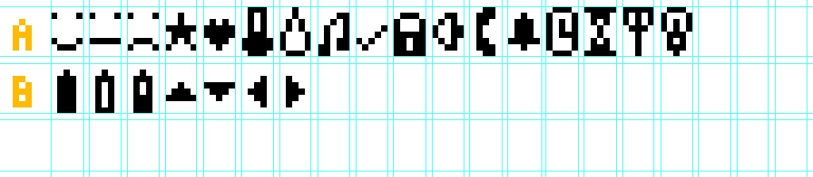

# LCDIcons #
## A little bit like a icon font in the web ##
When you design interfaces on LCD-Displays sometimes you need more then "normal" A-Z characters.
I created the class to reuse custom icons on such displays.

### Iconlist ###

Watch LCDIcons.h for names of the icons.

### Installation ###
* Download LCDIcons.zip from GitHub
* Open Arduino IDE, go to Sketch > Import Library and select the zip-File
There is a small example within the Library.